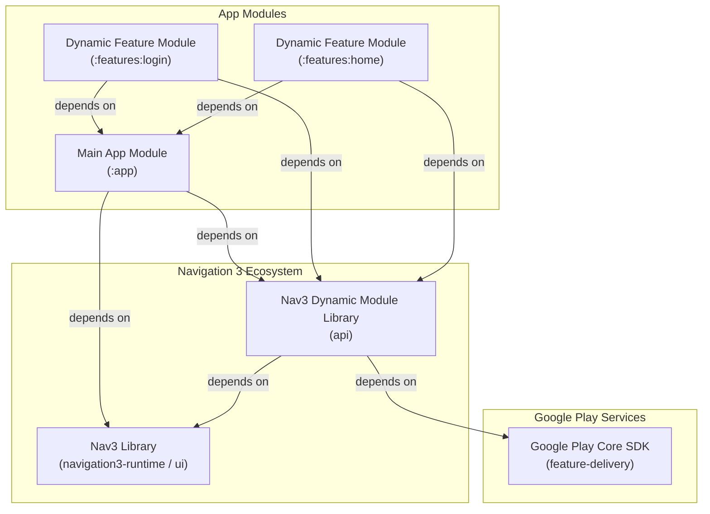
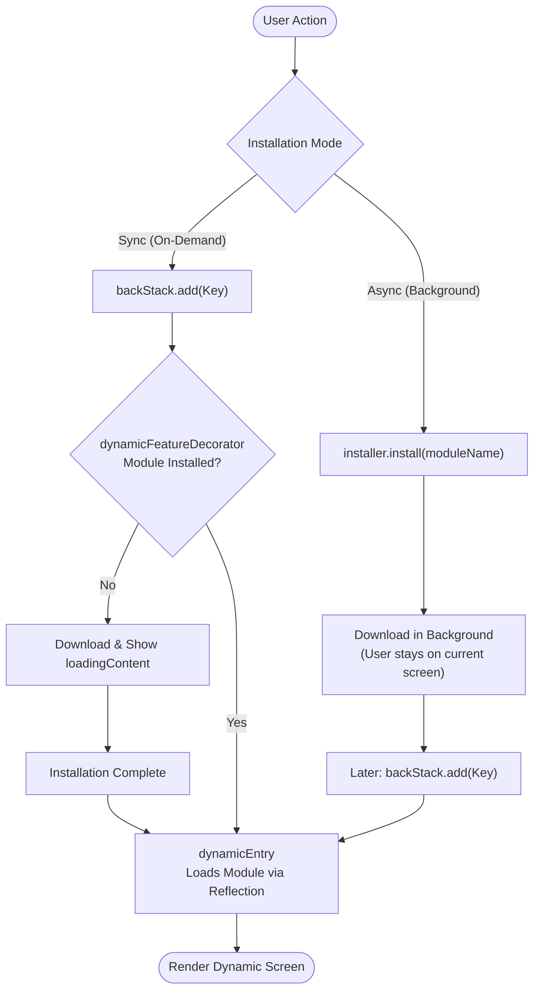

# Dynamic Feature Modules in Jetpack Navigation 3

**Disclaimer**: This README is generated by Antigravity. It looks legit to me, but I haven't checked thoroughly yet. I'll update README later.

A reference architecture and blueprint for integrating **Dynamic Feature Modules (DFMs)** into **Android Navigation 3**.

---

## Introduction

In Android, **Dynamic Feature Modules (Play Feature Delivery)** allow developers to separate non-essential features into independent split APKs that can be downloaded on-demand or at install-time, reducing initial app download size.

In **Jetpack Navigation 3**, navigation is declarative and driven by keys (`NavKey`). However, because Gradle dynamic feature plugins enforce a one-way dependency from the dynamic feature module to the base `:app` module, the `:app` module cannot directly reference the dynamic module's `@Composable` screens at compile time.

This project demonstrates a clean, type-safe, and store-agnostic architecture to:
1. Define pure `NavKey`s in a shared scope without compile-time dependencies on feature implementations or custom key interfaces.
2. Intercept dynamic destinations at the Navigation 3 pipeline level using **`dynamicFeatureDecorator`** via standard `NavEntry.metadata`.
3. Support both **synchronous (navigation-driven on-demand)** and **asynchronous (background pre-fetching)** installation UX patterns.

---

## Architecture

### Module Structure & Dependencies



---

## Runtime Flow



---

## Core APIs

### 1. `DynamicModule` & `DynamicModuleMetadataKey`
Metadata descriptor and type-safe `NavMetadataKey` for dynamic destinations:

```kotlin
object DynamicModuleMetadataKey : NavMetadataKey<DynamicModule>

data class DynamicModule(
    val entryBuilderClassName: String,
    val moduleName: String,
)
```

### 2. `DynamicModuleEntryBuilder`
Interface implemented inside dynamic modules to register screens into Navigation 3:

```kotlin
fun interface DynamicModuleEntryBuilder {
    fun EntryProviderScope<NavKey>.build()
}
```

### 3. `DynamicFeatureInstaller` & `InstallStatus`
Store-agnostic contract for module installation and reactive status observation:

```kotlin
interface DynamicFeatureInstaller {
    val installedModules: Set<String>
    fun isInstalled(moduleName: String): Boolean
    fun observeStatus(moduleName: String): Flow<InstallStatus>
    fun install(moduleName: String)
    fun uninstall(moduleName: String)
}

sealed interface InstallStatus {
    data object Pending : InstallStatus
    data class Downloading(val progress: Long) : InstallStatus
    data object Installing : InstallStatus
    data object Installed : InstallStatus
    data class UserConfirmationRequired(
        val onConfirm: (ActivityResultLauncher<IntentSenderRequest>) -> Unit
    ) : InstallStatus
    data class Failed(val errorCode: Int, val message: String? = null) : InstallStatus
}
```

### 4. `dynamicFeatureDecorator`
Centralized Navigation 3 decorator that automatically manages the installation lifecycle and loading UI via metadata:

```kotlin
inline fun <reified T : Any> dynamicFeatureDecorator(
    installer: DynamicFeatureInstaller,
    noinline loadingContent: @Composable (status: InstallStatus, key: T) -> Unit = { _, _ -> }
): NavEntryDecorator<T>
```

### 5. `dynamicEntry`
Safe destination registration that resolves `DynamicModule` via reflection, injects it into `NavEntry.metadata`, and defers class loading:

```kotlin
inline fun <reified K : NavKey> EntryProviderScope<in K>.dynamicEntry(
    noinline clazzContentKey: (key: @JvmSuppressWildcards K) -> Any = { it },
    metadata: Map<String, Any> = emptyMap(),
)
```

---

## Step-by-Step Implementation

### 1. Define the Key (Pure `NavKey`)

```kotlin
object LoginModule {
    val module = DynamicModule(
        entryBuilderClassName = "com.example.login.LoginEntryBuilder",
        moduleName = "login",
    )

    @Serializable
    data object Login : NavKey
}
```

### 2. Implement the Entry Builder (in dynamic feature module `:features:login`)

```kotlin
class LoginEntryBuilder : DynamicModuleEntryBuilder {
    override fun EntryProviderScope<NavKey>.build() {
        entry<LoginModule.Login> {
            LoginScreen()
        }
    }
}
```

### 3. Setup in `MainActivity`

```kotlin
val backStack = rememberNavBackStack(MainScreenKey)
val installer = retain { PlayCoreDynamicFeatureInstaller(context) }

NavDisplay(
    backStack = backStack,
    onBack = backStack::removeLastOrNull,
    // 🎯 1. Centralized dynamic feature decorator reading metadata:
    entryDecorators = listOf(
        dynamicFeatureDecorator(
            installer = installer,
            loadingContent = { status: InstallStatus, key: NavKey ->
                when (key) {
                    is LoginModule.Login -> {
                        DynamicFeatureProgressScreen(
                            moduleName = "Login Module",
                            status = status,
                            onCancel = { backStack.removeLastOrNull() }
                        )
                    }
                    else -> Unit
                }
            }
        )
    ),
    entryProvider = entryProvider {
        entry<MainScreenKey> {
            MainAppScreen(
                onNavigateToLogin = { backStack.add(LoginModule.Login) },
                onInstallHomeAsync = { installer.install(HomeModule.module.moduleName) },
                onNavigateToHome = { backStack.add(HomeModule.Home) }
            )
        }

        dynamicEntry<LoginModule.Login>()
        dynamicEntry<HomeModule.Home>()
    }
)
```

---

## Local Testing & Previews

To test dynamic feature delivery locally without uploading App Bundles to Google Play:

```kotlin
val fakeInstaller = retain { 
    FakeDynamicFeatureInstaller(stepDelayMs = 800L) 
}
```