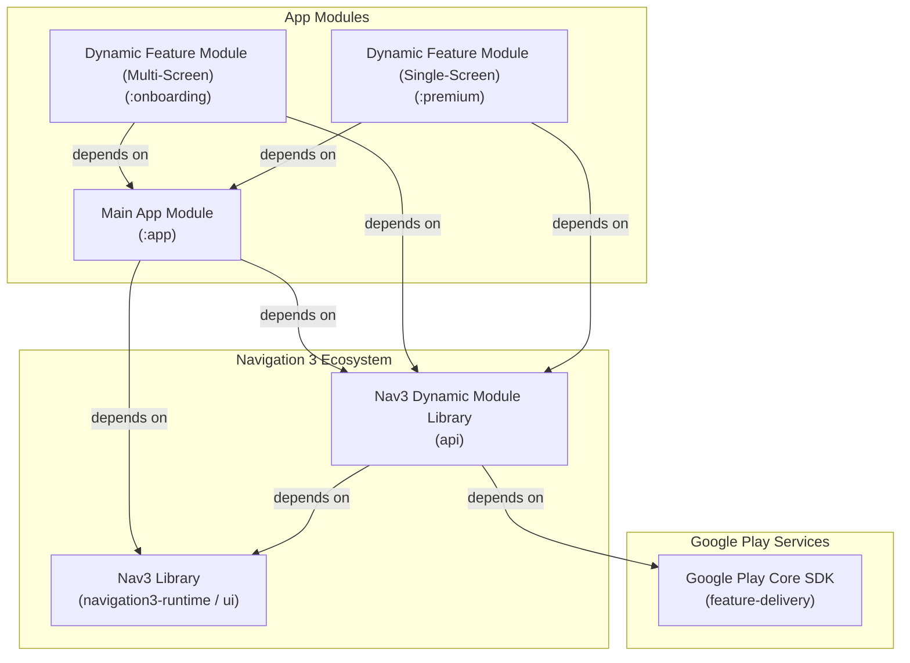
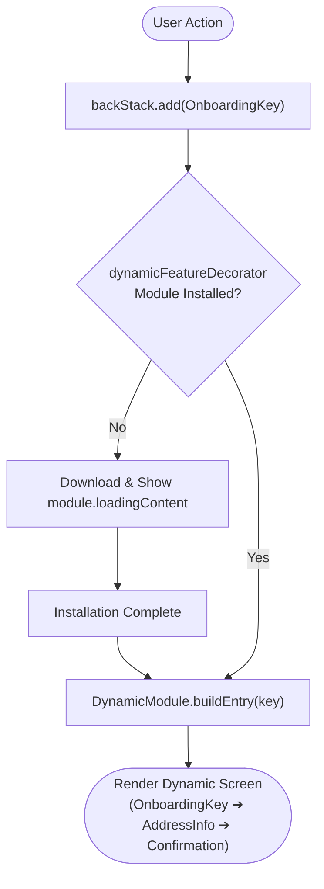

# Dynamic Feature Modules in Jetpack Navigation 3

Disclaimer: This README is generated by Jetski.
A reference architecture and blueprint for integrating **Dynamic Feature Modules (DFMs / Play Feature Delivery)** into **Android Navigation 3**.

---

## Introduction

In Android, **Dynamic Feature Modules (Play Feature Delivery)** allow developers to separate non-essential features into independent split APKs that can be downloaded on-demand or at install-time, reducing initial app download size.

In **Jetpack Navigation 3**, navigation is declarative and driven by keys (`NavKey`). However, because Gradle dynamic feature plugins enforce a one-way dependency from the dynamic feature module to the base `:app` module, the `:app` module cannot directly reference the dynamic module's `@Composable` screens at compile time.

This project demonstrates a clean, type-safe, and store-agnostic architecture where:
1. Dynamic modules are defined as **pure, self-contained `DynamicModule` instances** in `:app` (`OnboardingModule`, `PremiumModule`), encapsulating their entry builder, module name, and **custom loading UI**.
2. **Uses standard upstream `androidx.navigation3.ui.NavDisplay`** — no custom overloads or monolithic wrappers.
3. Installation lifecycle and progress UI are handled via the canonical **`rememberDynamicFeatureDecorator(splitInstallManager)`** in `entryDecorators`.
4. **DI Multibinding Friendly:** Dynamic modules are declared directly inside `entryProvider { dynamicModule(...) }` via `EntryProviderScope.dynamicModule`, enabling seamless integration with Dagger/Hilt `@IntoSet Set<EntryProviderScope<NavKey>.() -> Unit>`.
5. **Internal sub-screen keys stay 100% private to the dynamic APK** under a module-scoped `sealed interface OnboardingNavKey : NavKey`, making atomic popping trivial (`backStack.removeAll { it is OnboardingNavKey || it == OnboardingKey }`).
6. Supports **pure navigation-driven on-demand installation** on a **Single Global `NavBackStack`**.

---

## Architecture

### Module Structure & Dependencies



---

## Runtime Flow



---

## Core APIs

### 1. `DynamicModule` and Common Initial Keys
Pure data contract for dynamic destinations:

```kotlin
object DynamicModuleMetadataKey : NavMetadataKey<DynamicModule>

data class DynamicModule(
    val initialKey: NavKey,
    val moduleName: String,
    val entryBuilderClassName: String,
    val loadingContent: (@Composable (sessionState: SplitInstallSessionState?) -> Unit)? = null,
) {
    internal var isInstalled: Boolean by mutableStateOf(false)
}
```

### 2. `rememberDynamicFeatureDecorator`
Canonical Navigation 3 decorator that manages installation lifecycle via native `SplitInstallManager`, provisions `LocalInstallSessionState`, and accepts an optional default loading UI:

```kotlin
@Composable
fun rememberDynamicFeatureDecorator(
    splitInstallManager: SplitInstallManager = rememberSplitInstallManager(),
    defaultLoadingContent: (@Composable (sessionState: SplitInstallSessionState?) -> Unit)? = null,
): NavEntryDecorator<NavKey>
```

### 3. `EntryProviderScope.dynamicModule`
Extension function enabling declaration of dynamic modules directly inside standard `entryProvider { ... }`:

```kotlin
fun EntryProviderScope<NavKey>.dynamicModule(module: DynamicModule) {
    if (!module.isInstalled) {
        // 1. Module not installed: register placeholder for decorator to handle download & loading UI:
        entry(
            key = module.initialKey,
            metadata = metadata { put(DynamicModuleMetadataKey, module) }
        ) {
            val sessionState = LocalInstallSessionState.current
            module.loadingContent?.invoke(sessionState)
        }
    } else {
        // 2. Module is installed: inject module destinations directly (including module.initialKey):
        val builder = runCatching { module.instantiateBuilder() }.getOrNull()
        if (builder != null) {
            with(builder) {
                this@dynamicModule.build()
            }
        }
    }
}
```

### 4. `DynamicModuleEntryBuilder`
Contract implemented inside dynamic feature modules:

```kotlin
interface DynamicModuleEntryBuilder {
    fun EntryProviderScope<NavKey>.build()
}
```

### 5. `LocalNavBackStack`
CompositionLocal bridge allowing screens within dynamic feature modules to manipulate the global `NavBackStack`:

```kotlin
val LocalNavBackStack = staticCompositionLocalOf<NavBackStack<NavKey>> {
    error("No NavBackStack provided in current composition hierarchy.")
}
```

---

## Step-by-Step Implementation

### 1. Define Pure `DynamicModule`s with Initial Keys in `:app`

```kotlin
@Serializable data object OnboardingKey : NavKey
@Serializable data object PremiumKey : NavKey

val OnboardingModule = DynamicModule(
    initialKey = OnboardingKey,
    entryBuilderClassName = "com.example.onboarding.OnboardingEntryBuilder",
    moduleName = "onboarding",
    loadingContent = { sessionState ->
        val backStack = LocalNavBackStack.current
        DynamicFeatureProgressScreen(
            moduleName = "Onboarding Feature (Custom Module UI)",
            sessionState = sessionState,
            onCancel = { backStack.removeLastOrNull() }
        )
    }
)

val PremiumModule = DynamicModule(
    initialKey = PremiumKey,
    entryBuilderClassName = "com.example.premium.PremiumEntryBuilder",
    moduleName = "premium",
    loadingContent = null // Falls back to decorator's defaultLoadingContent
)
```

### 2. Implement Entry Builders with Sealed Interface Keys

#### Multi-screen `:onboarding` module:
```kotlin
// Sealed interface for internal sub-screens private to :onboarding:
@Serializable
sealed interface OnboardingNavKey : NavKey {
    @Serializable data object AddressInfo : OnboardingNavKey
    @Serializable data class Confirmation(val name: String, val city: String) : OnboardingNavKey
}

class OnboardingEntryBuilder : DynamicModuleEntryBuilder {
    override fun EntryProviderScope<NavKey>.build() {
        // Screen 1: Step 1 (Entry destination defined in :app)
        entry<OnboardingKey> {
            val backStack = LocalNavBackStack.current
            BasicInfoScreen(onProceedToAddress = { backStack.add(OnboardingNavKey.AddressInfo) })
        }

        // Screen 2: Step 2
        entry<OnboardingNavKey.AddressInfo> {
            val backStack = LocalNavBackStack.current
            AddressInfoScreen(onProceedToConfirmation = { backStack.add(OnboardingNavKey.Confirmation("Alex", "SF")) })
        }

        // Screen 3: Step 3
        entry<OnboardingNavKey.Confirmation> { key ->
            val backStack = LocalNavBackStack.current
            ConfirmationScreen(
                name = key.name, 
                city = key.city, 
                onComplete = {
                    backStack.removeAll { it is OnboardingNavKey || it == OnboardingKey }
                }
            )
        }
    }
}
```

#### Single-screen `:premium` module:
```kotlin
class PremiumEntryBuilder : DynamicModuleEntryBuilder {
    override fun EntryProviderScope<NavKey>.build() {
        entry<PremiumKey> {
            val backStack = LocalNavBackStack.current
            PremiumScreen(
                onBack = {
                    backStack.removeAll { it == PremiumKey }
                }
            )
        }
    }
}
```

### 3. Setup in `MainActivity`

```kotlin
val backStack = rememberNavBackStack(MainScreenKey)
val splitInstallManager = rememberSplitInstallManager()

val dynamicDecorator = rememberDynamicFeatureDecorator(
    splitInstallManager = splitInstallManager,
    defaultLoadingContent = { sessionState ->
        DynamicFeatureProgressScreen(
            moduleName = "Feature Delivery (Default Decorator UI)",
            sessionState = sessionState,
            onCancel = { backStack.removeLastOrNull() }
        )
    }
)

CompositionLocalProvider(LocalNavBackStack provides backStack) {
    NavDisplay(
        backStack = backStack,
        onBack = backStack::removeLastOrNull,
        entryDecorators = listOf(dynamicDecorator),
        entryProvider = entryProvider {
            entry<MainScreenKey> {
                MainAppScreen(
                    onStartOnboarding = { backStack.add(OnboardingKey) },
                    onNavigateToPremium = { backStack.add(PremiumKey) }
                )
            }

            dynamicModule(OnboardingModule)
            dynamicModule(PremiumModule)
        }
    )
}
```

---

## Dagger / Hilt Multibinding Architecture

Because `dynamicModule` is an extension on `EntryProviderScope<NavKey>`, both static and dynamic features can be multibound using the exact same contract:

```kotlin
// In dynamic module's feature provider module:
@Provides
@IntoSet
fun provideOnboardingNavEntries(): EntryProviderScope<NavKey>.() -> Unit = {
    dynamicModule(OnboardingModule)
}

// In static module's feature provider module:
@Provides
@IntoSet
fun provideHomeNavEntries(): EntryProviderScope<NavKey>.() -> Unit = {
    entry<HomeKey> { HomeScreen() }
}

// In :app (MainActivity):
@Inject lateinit var featureNavBuilders: Set<EntryProviderScope<NavKey>.() -> Unit>

val entryProvider = entryProvider {
    featureNavBuilders.forEach { buildScope -> buildScope() }
}
```

---

## Testing

The architecture natively consumes standard Android and Play Core components (`SplitInstallManager`), allowing testing using Google's official `FakeSplitInstallManager`:

```kotlin
val fakeSplitInstallManager = FakeSplitInstallManagerFactory.create(context)
val decorator = rememberDynamicFeatureDecorator(
    splitInstallManager = fakeSplitInstallManager
)
```